# ReadMoreTextView

<a href="https://opensource.org/licenses/Apache-2.0"></a>
<a href='https://developer.android.com'></a>

This library provides collapsible Text widgets with 'Read more' and 'Read less' text. (Including [Jetpack Compose][compose])

| **Collapsed** | 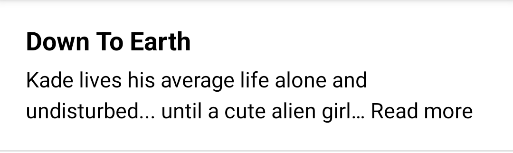 |
| ------------- | -------------------------------------------- |
| **Expanded**  | 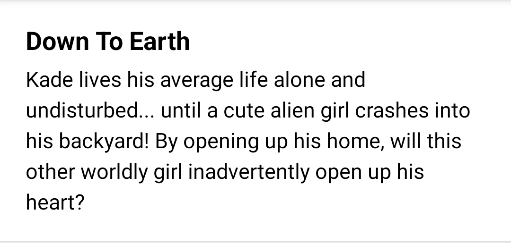  |

## Versions

Each [release](https://github.com/webtoon/ReadMoreTextView/releases) outlines the version of the AppCompat or Compose library it depends on.

<table>
 <tr><td>AppCompat 1.3 (1.3.x)</td><td></td></tr>
 <tr><td>AppCompat 1.4 (1.4.x)</td><td></td></tr>
 <tr><td>AppCompat 1.5 (1.5.x)</td><td></td></tr>
 <tr><td>AppCompat 1.6 (1.6.x)</td><td></td></tr>
 <tr><td>Compose 1.1 (1.1.x)</td><td></td></tr>
 <tr><td>Compose 1.2 (1.2.x)</td><td></td></tr>
 <tr><td>Compose 1.3 (1.3.x)</td><td></td></tr>
 <tr><td>Compose 1.4 (1.4.x)</td><td></td></tr>
 <tr><td>Compose 1.5 (1.5.x)</td><td></td></tr>
</table>

## Libraries

We are currently releasing various libraries for AppCompat or Compose.

### [ReadMore-View](./readmore-view/)
A library that provides collapsible `TextView` with 'Read more' and 'Read less' text. (for Android View System)

### [ReadMore-Foundation](./readmore-foundation/)
A library that provides collapsible `BasicText` with 'Read more' and 'Read less' text. (for [Jetpack Compose][compose])

### [ReadMore-Material](./readmore-material/)
A library that provides collapsible `Text` with 'Read more' and 'Read less' text based on Material Theme. (for [Jetpack Compose][compose])

### [ReadMore-Material3](./readmore-material3/)
A library that provides collapsible `Text` with 'Read more' and 'Read less' text based on Material3 Theme. (for [Jetpack Compose][compose])


## Attributes

This libraries provide the same attributes as much as possible regardless of View or [Compose][compose].

### Attributes for 'Read More'

#### `readMoreMaxLines`

| **2 (default)** | 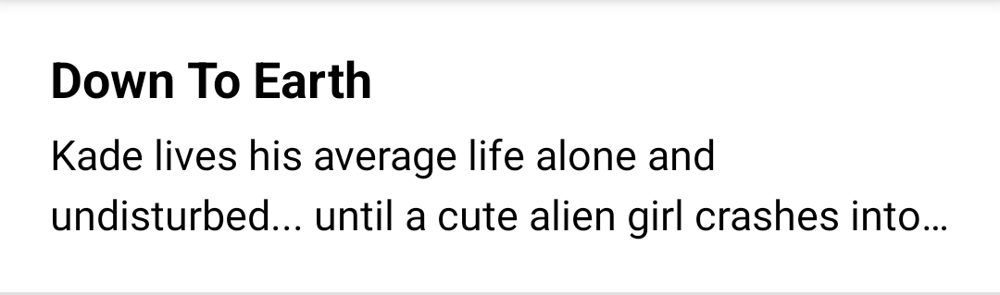 |
| --------------- | ------------------------------------------------------------ |
| **`"1"`**       | 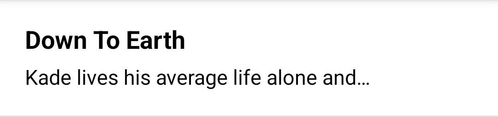 |

#### `readMoreOverflow`

| **Ellipsis (default)** |  |
| ---------------------- | ------------------------------------------------------------ |
| **Clip**               |  |

#### `readMoreText`

| **"" (default)**  |  |
| ----------------- | ------------------------------------------------------------ |
| **`"Read more"`** |  |

#### `readMoreTextSize`

| **Same with `textSize` (default)** | 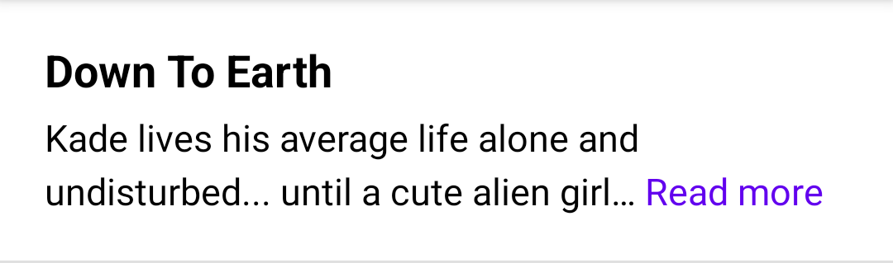 |
| ---------------------------------- | ------------------------------------------------------------ |
| **`"11sp"`**                       | 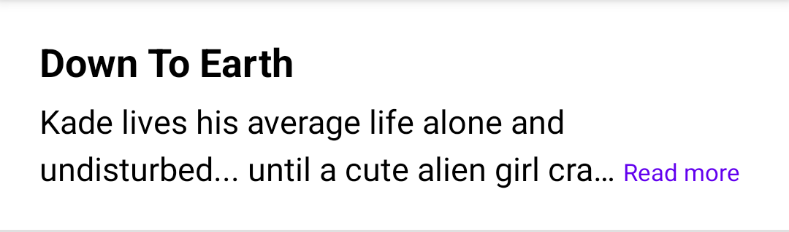 |

#### `readMoreTextColor`

| **Same with `textColor` (default)** |  |
| ----------------------------------- | ------------------------------------------------------------ |
| **`"#FF0000"`**                     | 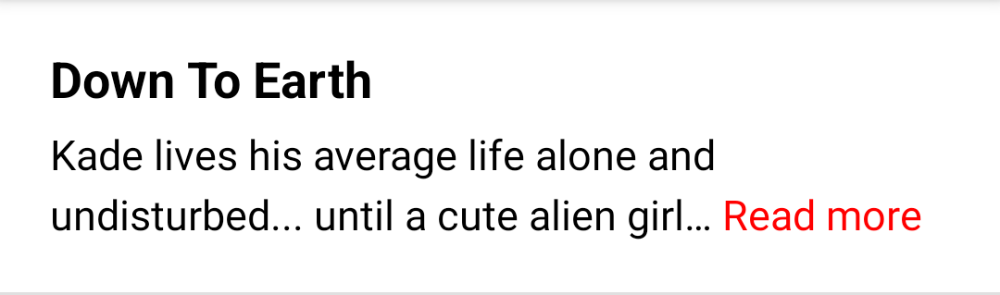 |

#### `readMoreTextStyle`

| **Normal (default)** |  |
| -------------------- | ------------------------------------------------------------ |
| **Bold**             | 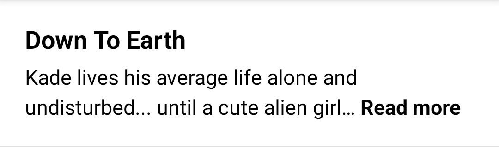 |
| **Italic**           |  |

#### `readMoreTextUnderline` (View only)

| **false (default)** |  |
| ------------------- | ------------------------------------------------------------ |
| **true**            |  |

#### `readMoreTextDecoration` (Compose only)

| **`null` (default)**  |  |
|-----------------------| ------------------------------------------------------------ |
| **`TextDecoration.Underline`** |  |

---

### Attributes for 'Read Less'

#### `readLessText`

| **"" (default)**  | 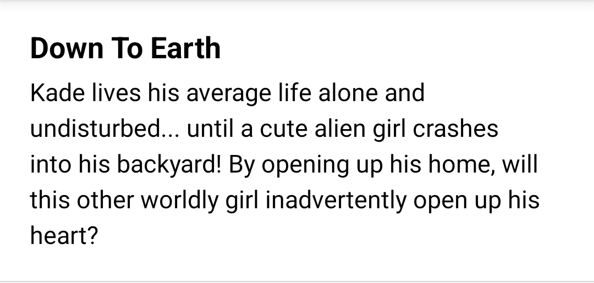 |
|-------------------| ------------------------------------------------------------ |
| **`"Read less"`** | 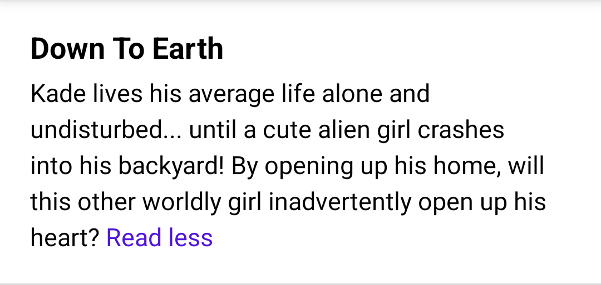 |

#### `readLessTextSize`

| **Same with `textSize` (default)** |  |
| ---------------------------------- | ------------------------------------------------------------ |
| **`"11sp"`**                       | 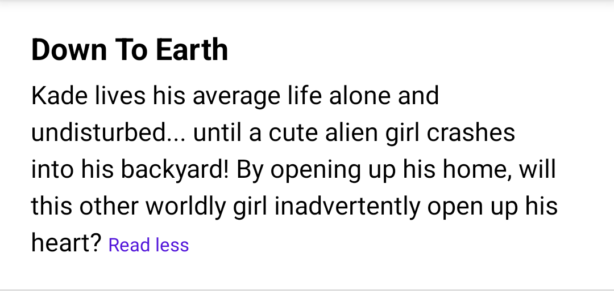 |

#### `readLessTextColor`

| **Same with `textColor` (default)** | 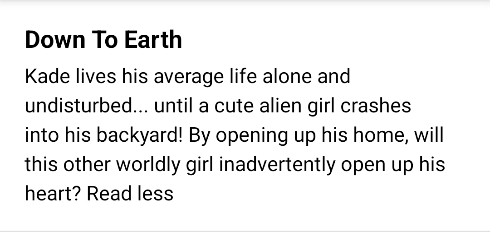 |
| ----------------------------------- | ------------------------------------------------------------ |
| **`"#FF0000"`**                     | 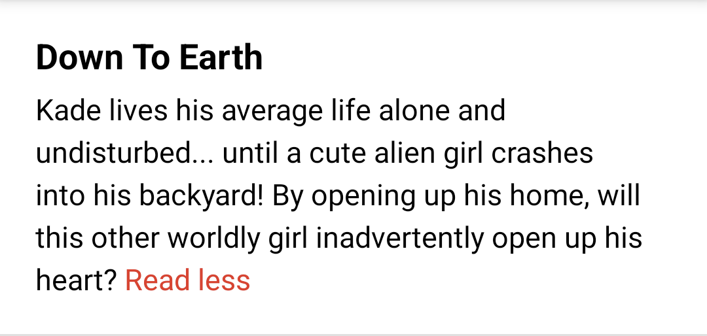 |

#### `readLessTextStyle`

| **Normal (default)** |  |
| -------------------- | ------------------------------------------------------------ |
| **Bold**             | 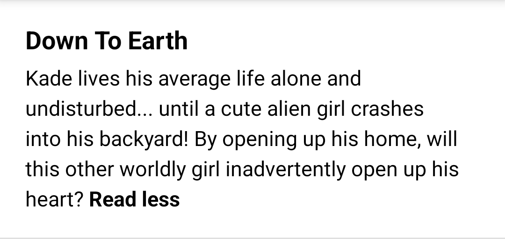 |
| **Italic**           | 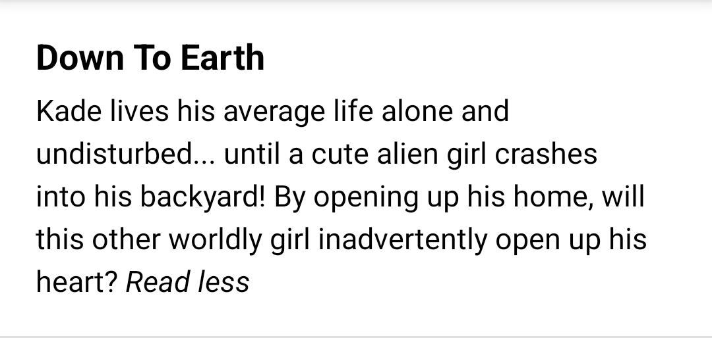 |

#### `readLessTextUnderline` (View only)

| **false (default)** |  |
| ------------------- | ------------------------------------------------------------ |
| **true**            | 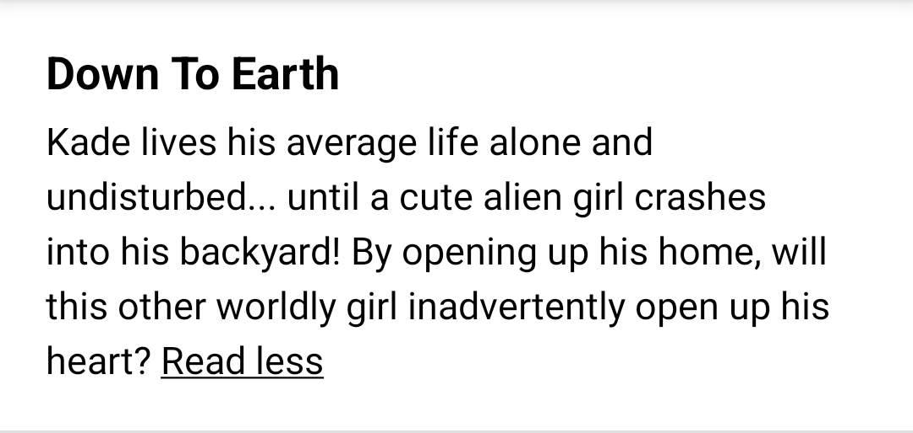 |

#### `readLessTextDecoration` (Compose only)

| **`null` (default)**  |  |
|-----------------------| ------------------------------------------------------------ |
| **`TextDecoration.Underline`** |  |

---

### Attributes for toggle area

The toggle area is the red box in the following image.

#### `readMoreToggleArea` (View only)

| **all (default)** | 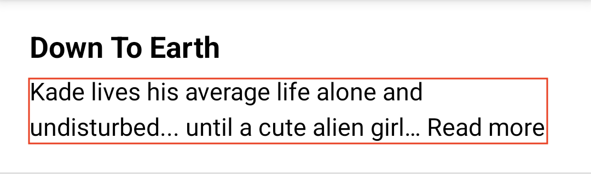  |
|-------------------|------------------------------------------------------------|
| **more**          |  |
| **none**          |  |

#### `toggleArea` (Compose only)

| **All (default)** |   |
|-------------------|---------------------------------------------------------------|
| **More**          | 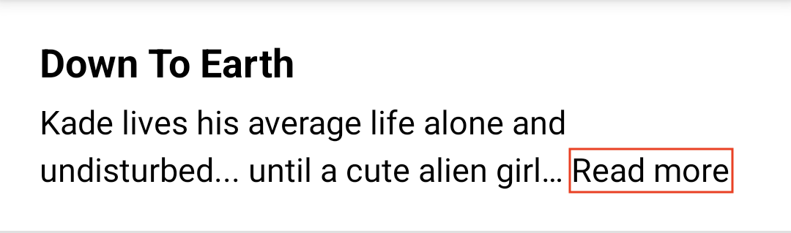 |

## Snapshots

If you want to check the version currently in development, you can use the [snapshot versions](https://s01.oss.sonatype.org/content/repositories/snapshots/com/webtoonscorp/android/).

The snapshot versions are updated on every commit to `main` branch.

```groovy
repositories {
    maven { url 'https://s01.oss.sonatype.org/content/repositories/snapshots' }
}

dependencies {
    // Check the latest SNAPSHOT version from the link above
    classpath 'com.webtoonscorp.android:readmore-view:XXX-SNAPSHOT'
}
```

## License

```
Copyright 2022 NAVER Webtoon

Licensed under the Apache License, Version 2.0 (the "License");
you may not use this file except in compliance with the License.
You may obtain a copy of the License at

    https://www.apache.org/licenses/LICENSE-2.0

Unless required by applicable law or agreed to in writing, software
distributed under the License is distributed on an "AS IS" BASIS,
WITHOUT WARRANTIES OR CONDITIONS OF ANY KIND, either express or implied.
See the License for the specific language governing permissions and
limitations under the License.
```

[compose]: https://developer.android.com/jetpack/compose
