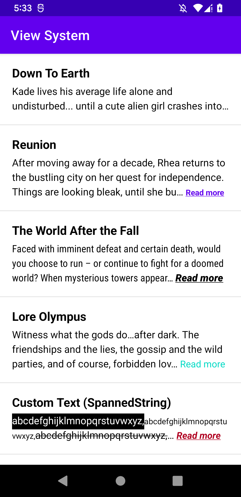

# ReadMoreTextView

A library that shows 'Read more' text in Android TextView.

| Collapsed                               | Expanded                              |
| --------------------------------------- | ------------------------------------- |
|  |  |

## Usage

```xml
<com.webtoonscorp.android.readmore.ReadMoreTextView
    android:layout_width="match_parent"
    android:layout_height="wrap_content"

    // Set maximum lines to show 'read more' text.
    app:readMoreMaxLines="3"
    app:readMoreOverflow="ellipsis"

    // Set 'read more' text and styles.
    app:readMoreText="@string/read_more"
    app:readMoreTextColor="?colorPrimary"
    app:readMoreTextFontFamily="sans-serif"
    app:readMoreTextSize="12sp"
    app:readMoreTextStyle="bold"
    app:readMoreTextUnderline="true"
    app:readMoreTypeface="normal"

    // Set textAppearance to 'read more' text.
    app:readMoreTextAppearance="@style/TextAppearance.AppCompat.Small"

    // If you want to use custom OnClickListener, you must be set this attribute to false.
    app:readMoreToggleEnabled="false"
    />
```

## Download

```groovy
repositories {
    mavenCentral()
}

dependencies {
    implementation "com.webtoonscorp.android:readmore:<version>"
}
```
